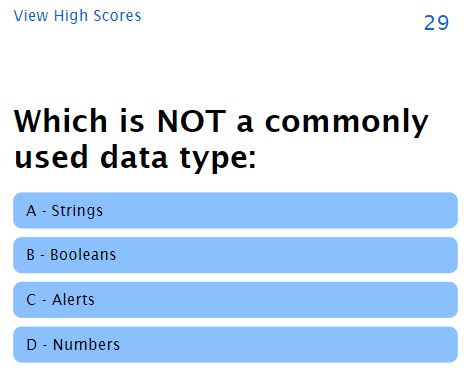
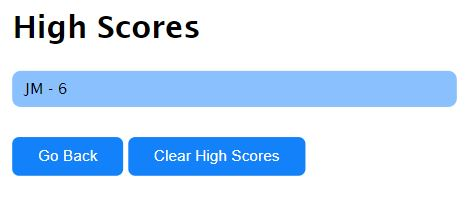

# Coding Quiz

## Description

This is a quiz designed to test your knowledge of HTML, CSS and JavaScript. The quiz counts down as you answer questions and it utilizes the web storage API to store a history of high scores. 

This project was a great oppurtunity to play around with API's and DOM manipulation to show/hide things based on user interaction.

## Usage
Visit the live site at the following URL: 
<a href="https://jonmooney.github.io/coding-quiz" title="CTRL+Click to open in a new window">https://jonmooney.github.io/coding-quiz/</a> 

## Screenshots
 

## Features
HTML 
CSS 
JavaScript - event listeners, functions, objects, DOM manipulation, API's 
Git/GitHub 
Command Line

## Credits
Idea provided by UC Davis Coding Boot Camp. All coding done by Jon Mooney

